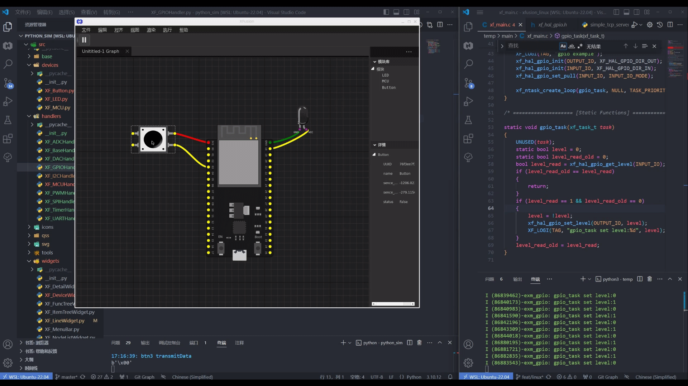

# XFusion 模拟器

采用 python 配合 pyside6 为 XFusion 写的一款模拟器。

# 基础原理

XFusion 切换为 linux_sim target 后, 这部分内容 XFusion 的 xf_hal 部分对接的是底层对接 TCP客户端 和模拟器服务端相连。
后续c语言配置操作外设，将会被打包成 tcp 消息，发送到模拟器。
模拟器运行时，通过 MCU 的IO传入给链接的芯片，芯片会传递给对应的 IO 口。通过流式传输传递给下一个模块进行处理。最终看到效果。

# 如何运行

1. 下载依赖库
```bash
pip install -r requirements.txt
```

2. 运行代码
```bash
python src/main.py 
```

3. 运行 [XFuison](https://github.com/x-eks-fusion/xfusion)
```bash
xf simulate
```

# 运行后效果


